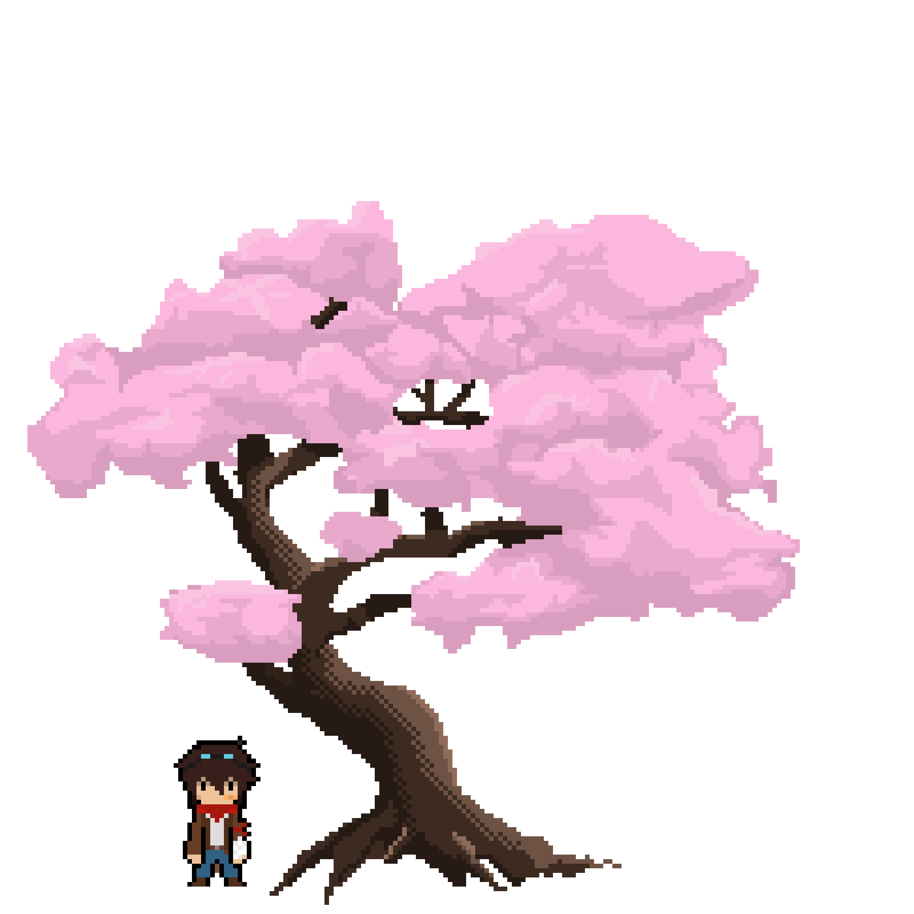
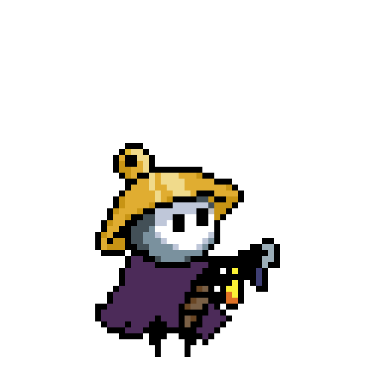

# Hi, I'm Daniel Villicana 👋

 

### Game Programmer | SMU Guildhall Graduate Student

Building gameplay systems, tools, rendering features, and AI experiences.

---

## About Me

I'm a game programmer with experience developing games and engine features in:

- Unreal Engine 5 (C++)
- Custom C++ Game Engines
- Gameplay Programming
- AI Systems
- Rendering & Graphics
- Tools Development

Currently focused on:

- Gameplay Engineering
- Graphics Programming
- Technical Design
- Engine Architecture

---

## Portfolio

Portfolio Website:

[https://danielvillicana.com/](https://danielvillicana.com/)

---

## Contact

- LinkedIn: [https://www.linkedin.com/in/daniel-villicana-6b28191ba/](https://www.linkedin.com/in/daniel-villicana-6b28191ba/)
- Portfolio: [https://danielvillicana.com/](https://danielvillicana.com/)
- Email: djvillicana@gmail.com

---

### Thanks for visiting!

